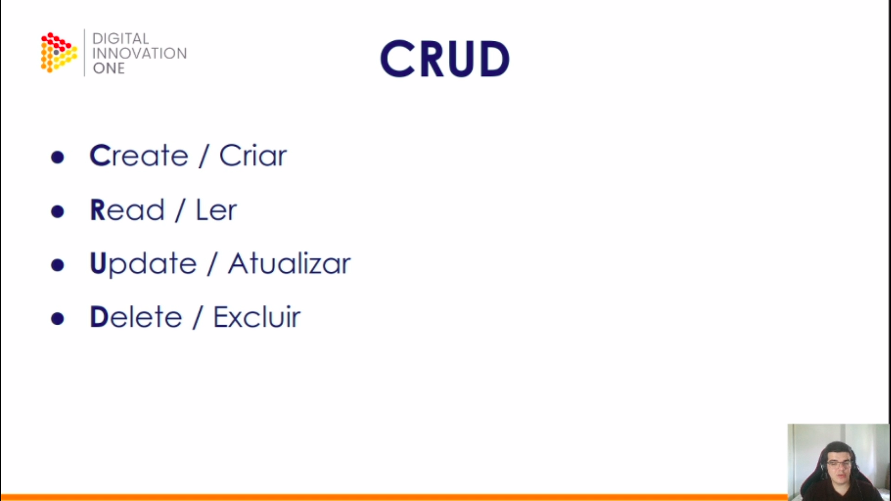
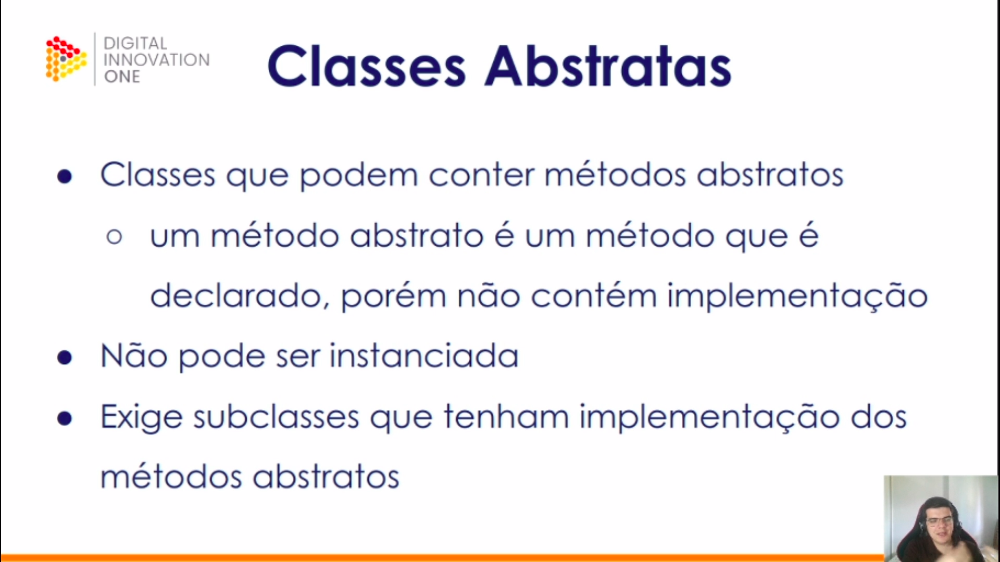
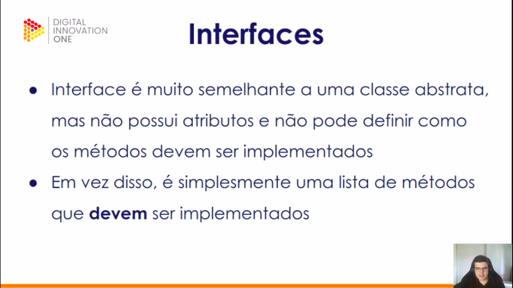
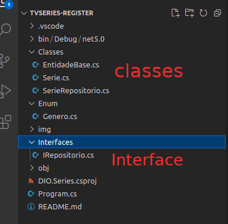
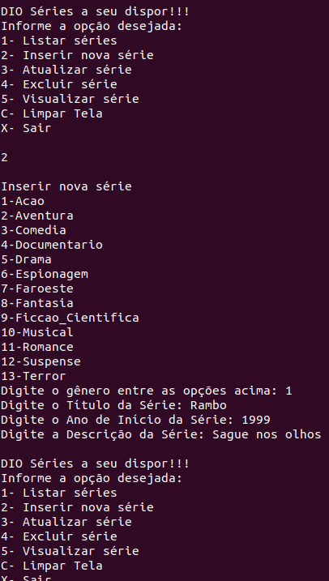

## Creating a tv series application with .NET
This application was presented and developed by <a href="https://www.linkedin.com/in/eliezerzarpelao/">Eliézer Zarpelão</a> and  <a href="https://web.digitalinnovation.one/home">Digital Innovation One</a>. It was part of the .NET Fundamentals bootcamp.

This time we worked on developing an app to register TV series. We reviewed POO regarding to .NET, model domain and some collections. Before getting started, some concepts were presented:

Interfaces were used to implement over the project as abstract classes' methods could not be instantiated, so it was subclassed. It was needed to create three different classes. Similarly to the previous project, enums were used, which speeded up the production.

<

Testing the app:

Some implementations still to be done, as I am just getting started into this adorable .NET world, it will take a while.